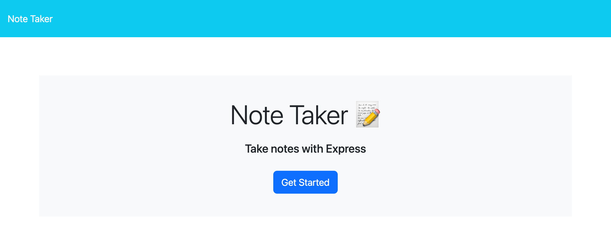
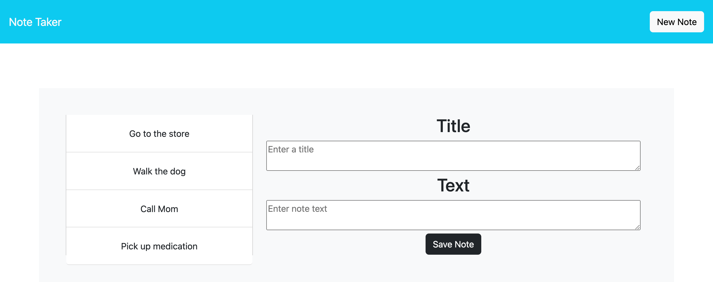

# EXPRESS NOTE TAKER APPLICATION
  
## Description:
  This is a simple note taking application that allows users to post notes, as well as view individual notes they have already posted.
  
## Table of Contents:
  <ol>
    <li><a href="#description">Description</a>
    <li><a href="#preview">Preview</a>
    <li><a href="#license">License</a>
    <li><a href="#techused">Technology/Resources Used</a>
    <li><a href="#contact">Contact Me</a>
  </ol>

## Preview:
  <a href="https://note-taker-011-dc9124d30848.herokuapp.com/">Deployed application</a>
  
  

## License:
  No license

## Technology/Resources Used:
  - Node/Express
  - Heroku
  
## Questions:
  For any additional questions, please contact me! You can reach me via:
  <ul>
    <li> Github: <a href="https://github.com/hanwol525">hanwol525</a>
    <li> Email: <a href="mailto:hannahwolfson05@gmail.com">hannahwolfson05@gmail.com</a>
  </ul>
